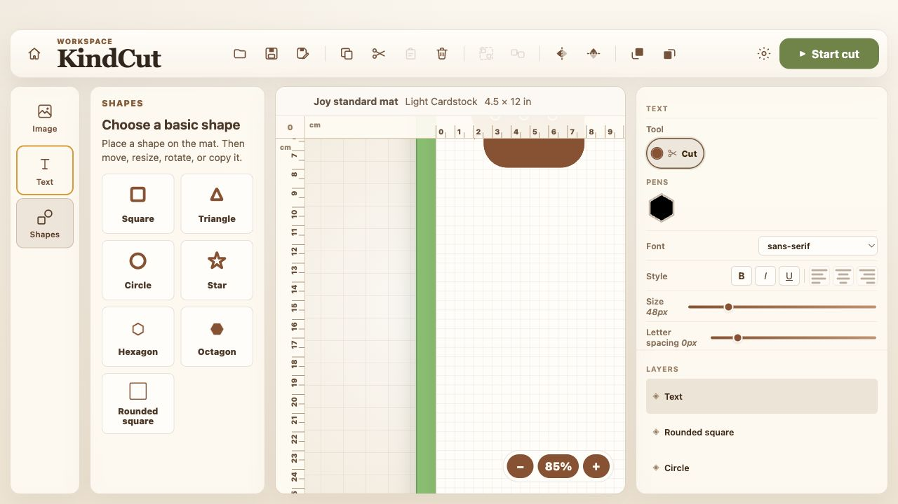
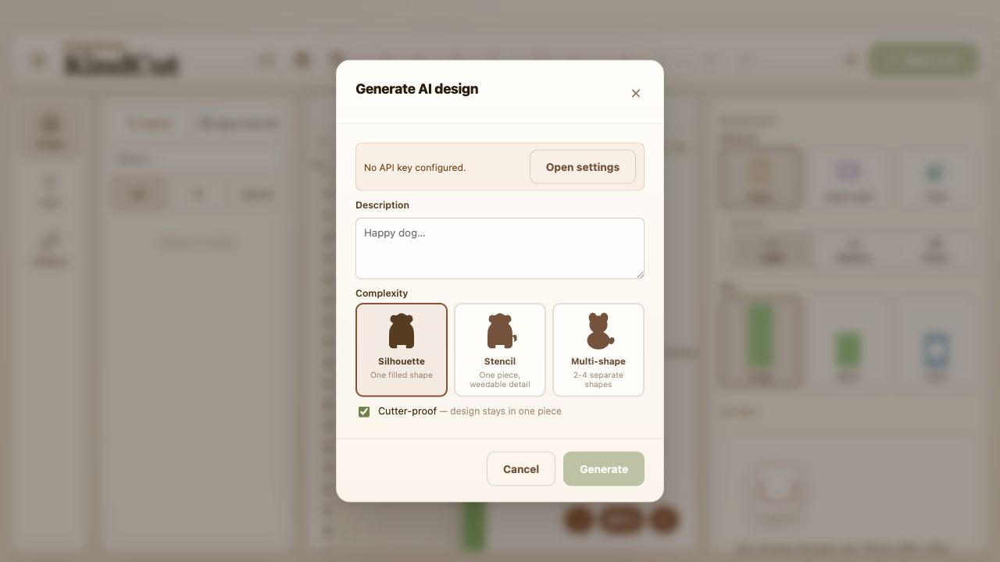

<p align="center">
  
</p>

<h1 align="center">KindCut</h1>

<p align="center">
  A calm, local-first desktop design app for simple cards, decals, labels, and pen-friendly craft projects.
</p>

<p align="center">
  <a href="https://github.com/desm-it/KindCut/releases/latest"><strong>Download latest release</strong></a>
  ·
  <a href="#install">Install</a>
  ·
  <a href="#update">Update</a>
  ·
  <a href="#build-from-source">Build from source</a>
</p>

## Why KindCut

KindCut is built for a simple flow: describe or import an idea, place it on a real-size mat, preview the layers, save the project locally, and prepare it for a cutter only when you are ready.

- **Beginner-friendly workspace** with clear tools for images, text, and basic shapes.
- **Local project files** so designs stay on your computer.
- **Layer preview** for cut and pen work before sending anything onward.
- **Text tools** with font choices, sizing, spacing, and pen-style options.
- **Image import** for SVGs, plus traced image workflows.
- **Bundled helper runtime** so release builds include the bridge needed for machine handoff.
- **No surprise hardware actions**. KindCut prepares and previews; the final action stays explicit.

## Screenshots

| Design workspace | Import and AI panel |
| --- | --- |
|  |  |

## Install

Download the latest release from the [KindCut releases page](https://github.com/desm-it/KindCut/releases/latest).

### macOS

1. Download `KindCut-...-arm64.dmg`.
2. Open the DMG.
3. Drag `KindCut` into `Applications`.
4. Open KindCut from `Applications`.

If macOS says the app cannot be opened because it is from an unidentified developer, open it once from Finder with right-click, then choose **Open**. Release signing is planned, but the current public builds are unsigned.

### Windows

1. Download `KindCut.Setup...exe`.
2. Run the installer.
3. Open KindCut from the Start menu or desktop shortcut.

If Windows SmartScreen warns about the app, choose **More info**, then **Run anyway** only if the file came from the official release page.

## First Run

1. Pick a language.
2. Start a new project or open an existing `.kindcut` file.
3. Open **Settings** and check the helper status.
4. If prompted, choose the installed design app location.
5. Run the one-time bootstrap from KindCut so local keys and materials can be detected.

After that, KindCut can prepare project handoff locally. It will not start a real machine action without an explicit preview and confirmation flow.

## Update

### macOS

1. Download the newest DMG from [Releases](https://github.com/desm-it/KindCut/releases/latest).
2. Quit KindCut.
3. Replace the old app in `Applications` with the new one.
4. Open KindCut again.

Your saved `.kindcut` files and local library stay separate from the app bundle.

### Windows

1. Download the newest setup `.exe` from [Releases](https://github.com/desm-it/KindCut/releases/latest).
2. Quit KindCut.
3. Run the installer.
4. Open KindCut again.

The installer updates the app while keeping local projects and settings in place.

## File Types

- `.kindcut` for editable KindCut projects.
- `.svg` for vector imports.
- `.png`, `.jpg`, and `.jpeg` for traced image workflows.

## Build From Source

Install dependencies:

```bash
npm install
```

Run the development app:

```bash
npm run dev
```

Run checks:

```bash
npm run check
```

Build release artifacts:

```bash
npm run package:desktop:mac
npm run package:desktop:win
```

Native desktop packages must be built on their target operating system because the bundled helper runtime is frozen per platform. The GitHub release workflow handles that automatically for official releases.

## Release Builds

When a GitHub Release is published, the release workflow builds:

- macOS Apple silicon DMG and ZIP
- Windows x64 setup installer
- update blockmaps for both platforms

The generated files are attached to the release automatically.

## Project Layout

```text
apps/desktop/              Desktop UI and shell
packages/craft-core/       Project model, mats, materials, and validation
packages/svg-preflight/    SVG cleanup and safety checks
packages/ai-designer/      AI prompt contracts and output validation
packages/slicebug-bridge/  Helper command construction and subprocess boundary
docs/                      Product, release, and architecture notes
vendor/                    Ignored third-party helper checkout
```

## Safety

KindCut treats machine output as a deliberate final step. Tests and demos should use previews, command builders, or fakes. Do not trigger real hardware from automated tests.
